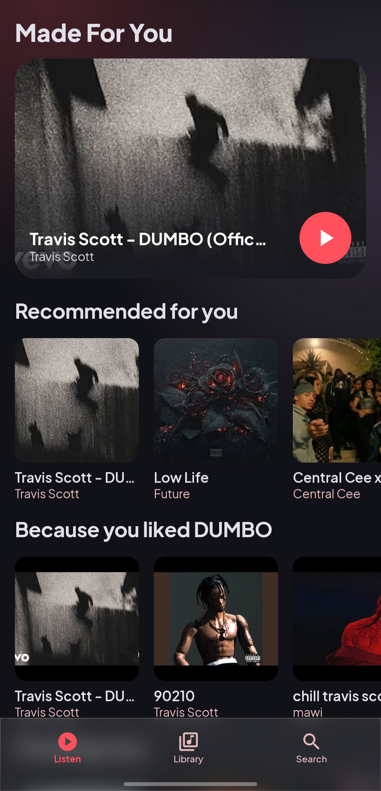
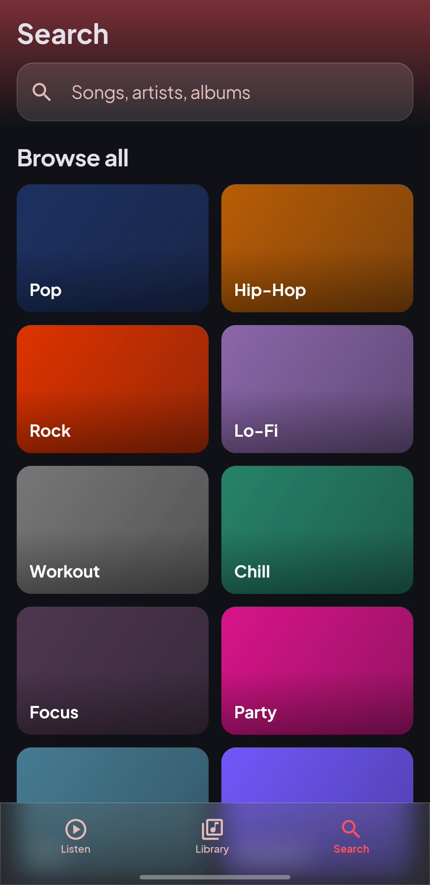
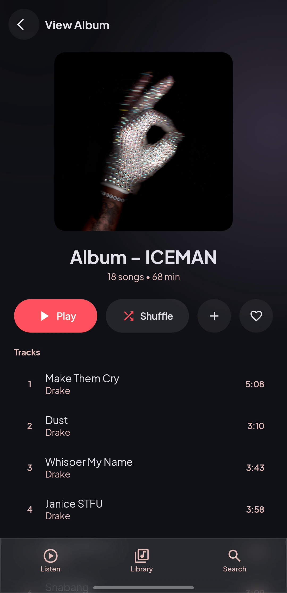
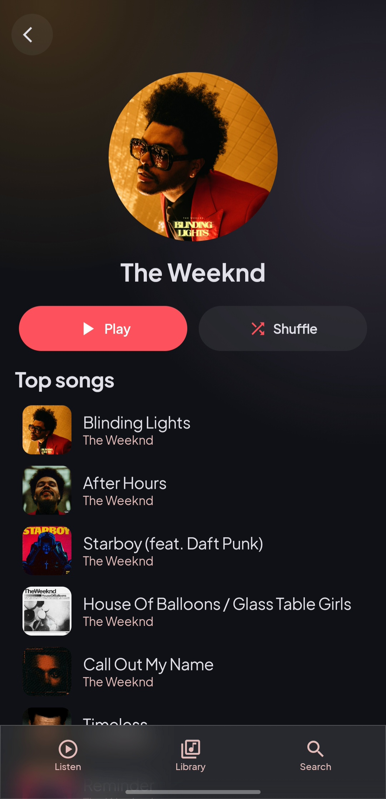
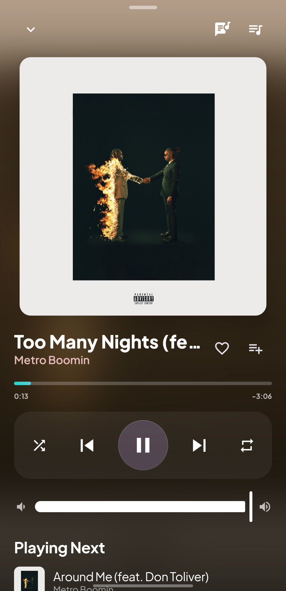
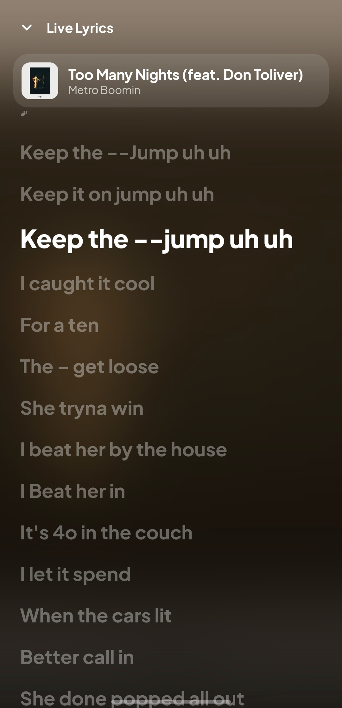

# MusicSM

**v2.0.2** — A dark, glassmorphic music‑streaming app for Android. Real audio streamed from YouTube via NewPipeExtractor and played through AndroidX Media3, wrapped in a Jetpack Compose UI inspired by an aurora‑glass design language (coral accent, Plus Jakarta Sans). Also plays music stored on your device.

> **Not shippable to Google Play.** MusicSM streams from YouTube and depends on GPLv3 `NewPipeExtractor`; it is a personal / educational project, not a distributable product.

---

## Features

**Browse & discover**
- **Home** — taste‑based shelves from your history, likes, and followed artists (*Recommended for you*, *Because you liked …*, *From artists you follow*), real **Trending now**, plus curated genre/mood tiles. Pull‑to‑refresh, shimmer skeletons; offline fallback to downloads/recent/liked.
- **Search** — songs, albums, artists; **Album** and **Artist** detail pages; follow artists.
- **Listening Stats** — top tracks/artists over time.

**Library, playlists & sharing**
- Liked songs + local playlists (custom covers, delete).
- **Local files** — play music stored on the device (scanned from MediaStore); like it and add it to playlists like any track.
- **Import from a Spotify link** — paste a public playlist URL; tracks matched on YouTube and saved.
- **Share** playlists via link / QR code, and **scan** a code to open one.
- **Backup & restore** — export the whole library + settings to a portable JSON file and merge it back on a new install (no account login needed).

**Offline**
- **Automatic caching** — played tracks are cached to disk (LRU‑capped) and replay offline, Spotify‑style.
- **Downloads** — explicit offline downloads with a background service + notification, a Downloads page, and album/playlist bulk download.

**Playback**
- Background playback via a Media3 **MediaLibraryService**; notification / lockscreen controls reopen the app.
- **True overlapping crossfade**, **equalizer + audio effects** (bass boost, virtualizer, loudness, skip‑silence, speed), **sleep timer**, high‑bitrate audio.
- Frame‑interpolated position so the seek bar and live synced lyrics stay smooth.
- **Resilient streaming** — an expired or rejected stream URL is re‑resolved on the fly, and a track that still fails is skipped rather than stalling playback.

**Beyond the phone**
- **Android Auto** (browse + play), **Wear OS** transport, a **home‑screen widget**, a **Quick Settings tile**, deep links / "Open with" & "Share to MusicSM" for YouTube links, and voice "play … on MusicSM".

**Now Playing** — blurred artwork backdrop, breathing album art, hue‑cycling frosted‑glass play/pause button, animated multi‑hue seek bar, glassy album‑tinted volume, queue, and live lyrics.

**Support** — a "Buy me a coffee" option at the top of Settings pays over **UPI** (Google Pay / PhonePe / Paytm / any UPI app) or copies the UPI ID.

**In-app updates** — checks GitHub for a newer release on launch (and from **Settings → Check for updates**), then downloads the APK and opens the installer — no need to visit the releases page.

## Screenshots

> Drop images into `docs/screenshots/` with the filenames below (PNG). They'll render here automatically.

| Home | Search | Album |
|------|--------|-------|
|  |  |  |

| Artist | Now Playing | Lyrics |
|--------|-------------|--------|
|  |  |  |

## Tech stack

| Area | Choice |
|------|--------|
| Language | Kotlin 2.3.20 (JVM 17) |
| UI | Jetpack Compose + Material 3, MVVM |
| Build | Gradle 9.5, AGP 9.3.2 (built‑in Kotlin), KSP 2.3.11 |
| DI | Hilt 2.60.1 |
| Playback | AndroidX Media3 1.11.0 (ExoPlayer + MediaLibraryService, cache, effects) |
| Data | NewPipeExtractor v0.26.5 (YouTube); Spotify public embed for playlist import |
| Storage | Room 2.8.4 (v6 schema) |
| Images | Coil 3 |
| Glass blur | Haze |
| Reach | Android Auto · Wear OS · App Widget · Quick Settings tile |

## Architecture

Single `:app` module, layered so nothing above the data layer knows the source is YouTube.

```
ui/            Compose screens + ViewModels (home, search, library, album, artist,
               player, importer, settings, stats, share, actions)
navigation/    Routes, root scaffold, NavHost, bottom bar
domain/        Pure Kotlin models + repository/source interfaces (+ recommend, match)
data/          Impls — only layer importing NewPipe / Room / Spotify / prefs
playback/      Media3 bridge (service, controller, resolver, crossfade, effects, sleep timer)
download/      Foreground download service
update/        In-app updater (checks GitHub Releases, installs the APK)
di/            Hilt modules (data, database, network, media cache)
widget/ tile/ wear/   Home‑screen widget · Quick Settings tile · Wear OS bridge
```

- `MusicSource` (interface) abstracts the catalog + audio; `NewPipeMusicSource` implements it against YouTube.
- `MusicRepository` moves work to IO, caches resolved streams briefly, and builds recommendations.
- `MediaControllerManager` exposes player state to Compose as a `StateFlow`.
- Stream URLs expire (~6 h, IP‑bound), so they are resolved per track at load time by `StreamUrlResolver`.

See [`.codemap.md`](.codemap.md) for a fuller map.

## Building

Requirements:

- Android Studio (uses its bundled JetBrains Runtime for `JAVA_HOME`)
- Android SDK with `compileSdk` / `targetSdk` 37, `minSdk` 24

```bash
# JAVA_HOME must point at the Android Studio JBR
./gradlew :app:assembleDebug
```

Notes:
- `android.disallowKotlinSourceSets=false` is required (AGP 9 built‑in Kotlin + KSP).
- NewPipeExtractor uses `java.nio.file`, so core‑library desugaring is enabled for `minSdk 24`.

## License / legal

Streams via GPLv3 `NewPipeExtractor` and accesses YouTube contrary to its Terms of Service. For personal and educational use only — do not distribute or publish.
